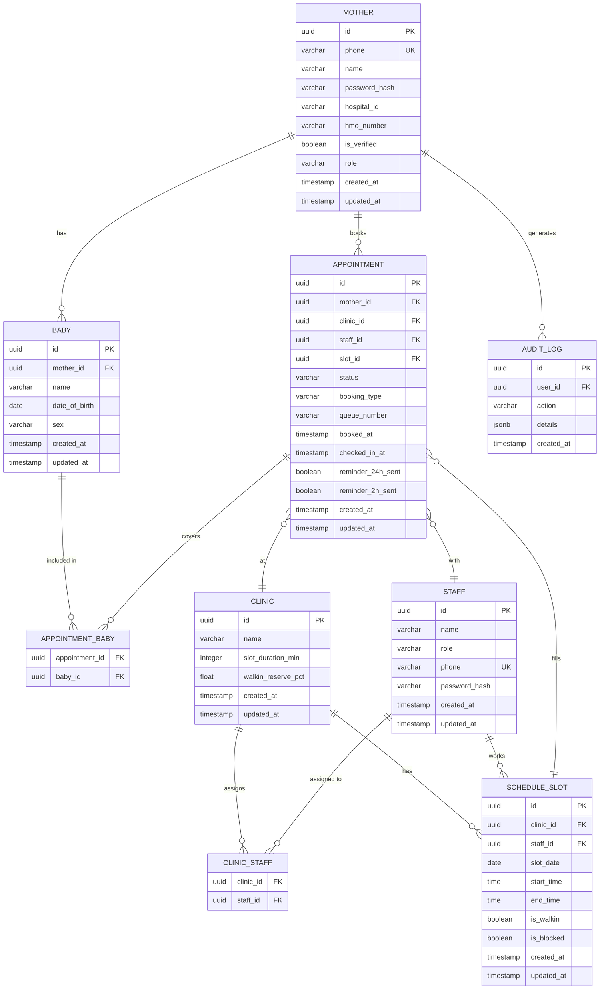

# Entity-Relationship Diagram

```mermaid
erDiagram
    MOTHER ||--o{ BABY : "has"
    MOTHER ||--o{ APPOINTMENT : "books"
    BABY ||--o{ APPOINTMENT_BABY : "included in"
    APPOINTMENT ||--o{ APPOINTMENT_BABY : "covers"
    CLINIC ||--o{ SCHEDULE_SLOT : "has"
    CLINIC ||--o{ CLINIC_STAFF : "assigns"
    STAFF ||--o{ CLINIC_STAFF : "assigned to"
    STAFF ||--o{ SCHEDULE_SLOT : "works"
    APPOINTMENT }o--|| SCHEDULE_SLOT : "fills"
    APPOINTMENT }o--|| CLINIC : "at"
    APPOINTMENT }o--|| STAFF : "with"
    MOTHER ||--o{ AUDIT_LOG : "generates"

    MOTHER {
        uuid id PK
        varchar phone UK
        varchar name
        varchar password_hash
        varchar hospital_id
        varchar hmo_number
        boolean is_verified
        varchar role
        timestamp created_at
        timestamp updated_at
    }

    BABY {
        uuid id PK
        uuid mother_id FK
        varchar name
        date date_of_birth
        varchar sex
        timestamp created_at
        timestamp updated_at
    }

    STAFF {
        uuid id PK
        varchar name
        varchar role
        varchar phone UK
        varchar password_hash
        timestamp created_at
        timestamp updated_at
    }

    CLINIC {
        uuid id PK
        varchar name
        integer slot_duration_min
        float walkin_reserve_pct
        timestamp created_at
        timestamp updated_at
    }

    CLINIC_STAFF {
        uuid clinic_id FK
        uuid staff_id FK
    }

    SCHEDULE_SLOT {
        uuid id PK
        uuid clinic_id FK
        uuid staff_id FK
        date slot_date
        time start_time
        time end_time
        boolean is_walkin
        boolean is_blocked
        timestamp created_at
        timestamp updated_at
    }

    APPOINTMENT {
        uuid id PK
        uuid mother_id FK
        uuid clinic_id FK
        uuid staff_id FK
        uuid slot_id FK
        varchar status
        varchar booking_type
        varchar queue_number
        timestamp booked_at
        timestamp checked_in_at
        boolean reminder_24h_sent
        boolean reminder_2h_sent
        timestamp created_at
        timestamp updated_at
    }

    APPOINTMENT_BABY {
        uuid appointment_id FK
        uuid baby_id FK
    }

    AUDIT_LOG {
        uuid id PK
        uuid user_id FK
        varchar action
        jsonb details
        timestamp created_at
    }
```
