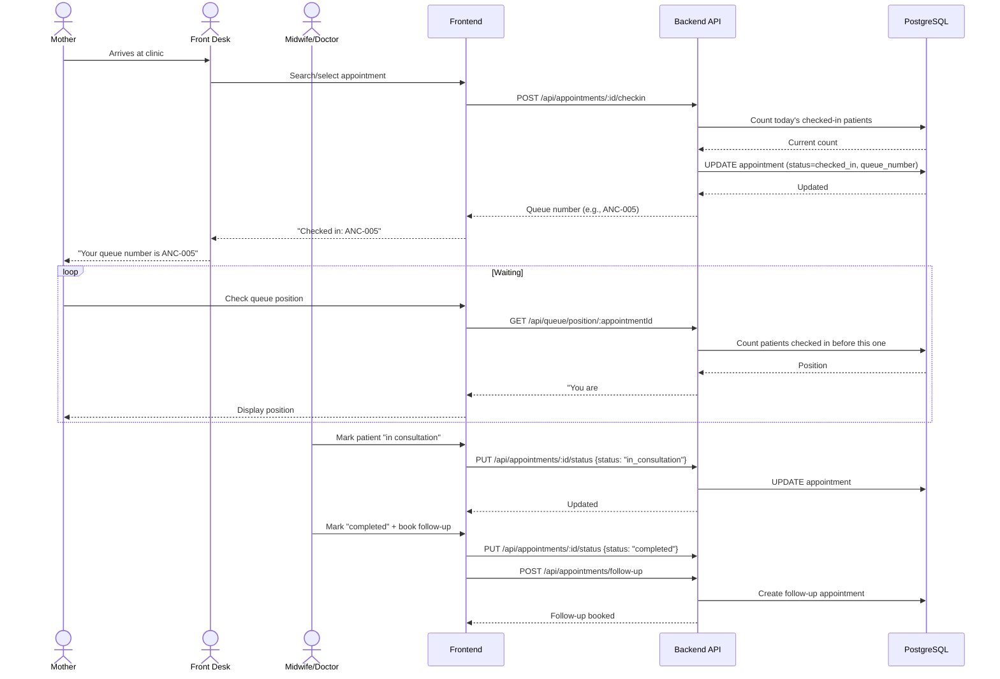

# Sequence Diagram: Check-In & Queue Flow

```mermaid
sequenceDiagram
    actor Mother
    actor FrontDesk as Front Desk
    actor Midwife as Midwife/Doctor
    participant FE as Frontend
    participant API as Backend API
    participant DB as PostgreSQL

    Mother->>FrontDesk: Arrives at clinic
    FrontDesk->>FE: Search/select appointment
    FE->>API: POST /api/appointments/:id/checkin
    API->>DB: Count today's checked-in patients
    DB-->>API: Current count
    API->>DB: UPDATE appointment (status=checked_in, queue_number)
    DB-->>API: Updated
    API-->>FE: Queue number (e.g., ANC-005)
    FE-->>FrontDesk: "Checked in: ANC-005"
    FrontDesk-->>Mother: "Your queue number is ANC-005"

    loop Waiting
        Mother->>FE: Check queue position
        FE->>API: GET /api/queue/position/:appointmentId
        API->>DB: Count patients checked in before this one
        DB-->>API: Position
        API-->>FE: "You are #3 in queue"
        FE-->>Mother: Display position
    end

    Midwife->>FE: Mark patient "in consultation"
    FE->>API: PUT /api/appointments/:id/status {status: "in_consultation"}
    API->>DB: UPDATE appointment
    API-->>FE: Updated

    Midwife->>FE: Mark "completed" + book follow-up
    FE->>API: PUT /api/appointments/:id/status {status: "completed"}
    FE->>API: POST /api/appointments/follow-up
    API->>DB: Create follow-up appointment
    API-->>FE: Follow-up booked
```
