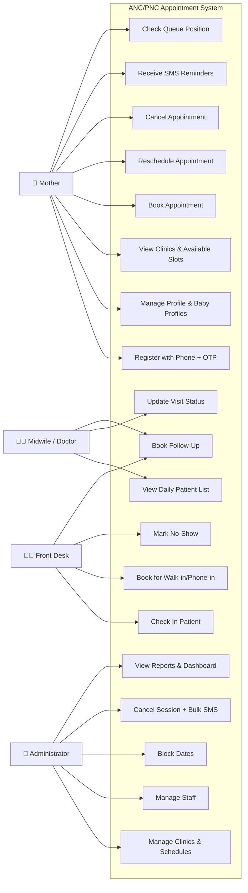

# Use Case Diagram

```mermaid
graph LR
    subgraph System["ANC/PNC Appointment System"]
        UC1["Register with Phone + OTP"]
        UC2["Manage Profile & Baby Profiles"]
        UC3["View Clinics & Available Slots"]
        UC4["Book Appointment"]
        UC5["Reschedule Appointment"]
        UC6["Cancel Appointment"]
        UC7["Receive SMS Reminders"]
        UC8["Check Queue Position"]
        UC9["Check In Patient"]
        UC10["View Daily Patient List"]
        UC11["Update Visit Status"]
        UC12["Book Follow-Up"]
        UC13["Book for Walk-in/Phone-in"]
        UC14["Mark No-Show"]
        UC15["Manage Clinics & Schedules"]
        UC16["Manage Staff"]
        UC17["Block Dates"]
        UC18["Cancel Session + Bulk SMS"]
        UC19["View Reports & Dashboard"]
    end

    Mother["👩 Mother"] --> UC1
    Mother --> UC2
    Mother --> UC3
    Mother --> UC4
    Mother --> UC5
    Mother --> UC6
    Mother --> UC7
    Mother --> UC8

    FrontDesk["🧑‍💼 Front Desk"] --> UC9
    FrontDesk --> UC13
    FrontDesk --> UC14
    FrontDesk --> UC12

    Midwife["👩‍⚕️ Midwife / Doctor"] --> UC10
    Midwife --> UC11
    Midwife --> UC12

    Admin["🔧 Administrator"] --> UC15
    Admin --> UC16
    Admin --> UC17
    Admin --> UC18
    Admin --> UC19
```
